# Proyecto Python POO - Zoologico

### Presentacion

Mi proyecto esta basado en una modelacion de un Zoologico en programacion orientada a objetos en el lenguaje de python, me base en hacer un modelamiento no muy complejo, en el programa implemente 6 botones con el cual el usuario puede hacer diversa acciones, para este proceso tome clases como animales, habitas y un zoologico.Aparte tambien un controlador y una vista, me base en comportamientos como comer, dormir e jugar, estos comportamientos se le pueden simular a los animales que esten dentro de habitas ya establecidas por el usuario.

### Explicacion de codigo

El codigo al ejecutarse mostrara un menu que esta compuesto por 6 botones.

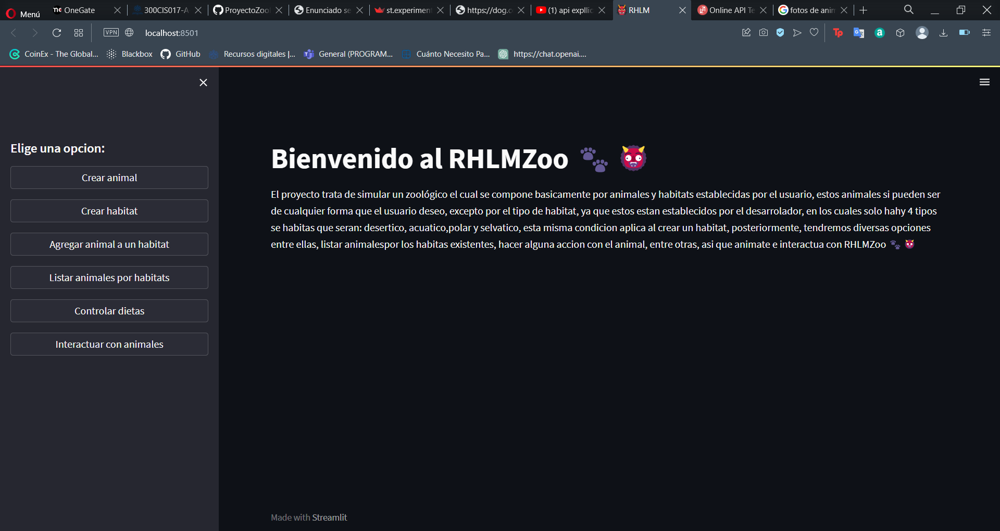

#### Opcion 1

Al presionar este boton nos dara la opcion de crear un animal en un registro del zoologico, en este momento nos pedira diversos datos y posteriormente creamos en animal
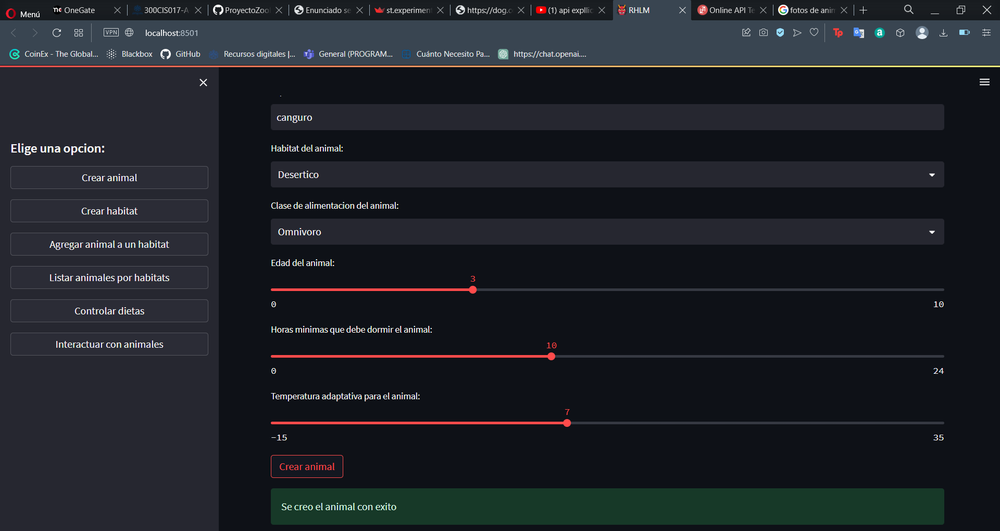

### Opcion 2

Al ingresar la opcion 2 podremos crear el habitat, en este nos saldran diversas opciones, pero en el caso de 2 de estas, se basan en el tipo de habitat ya que dependiendo de este te preguntara dos atributos distintos a los de las demas habitats y tambien otra temperatura disponible
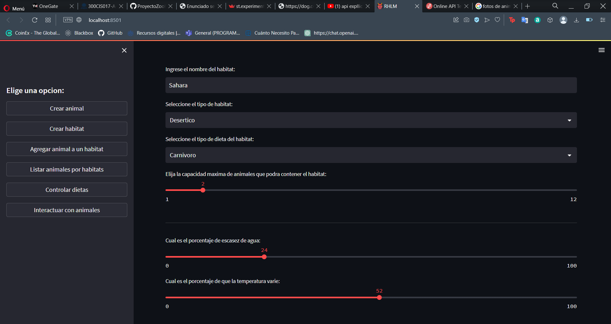

### Opcion 3

Al ingresar la opcion 3, podremos ingresar el animal ya creado por el usuario al habitat creado tambien por el usuario, esto si verificando que el animal cumpla con los requisitos adaptativos del habitat, en caso de no cumplir no se le dejara ingresar a este habitat
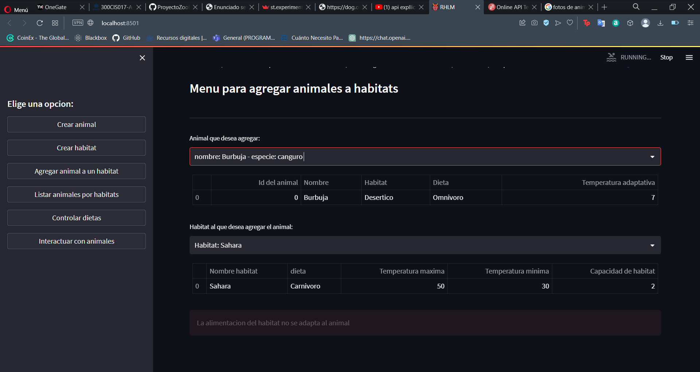
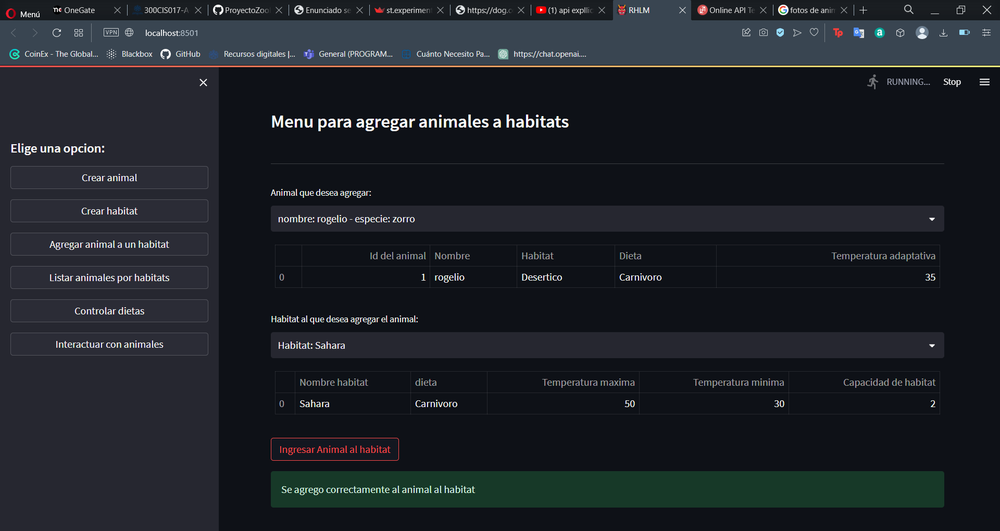

### Opcion 4

Al ingresar la opcion 4 podremos ver los animales que tenemos listados por habitat en nuestro zoologico y tambien nos enseñara los atributos que se le establecieron al habitat al crearlo
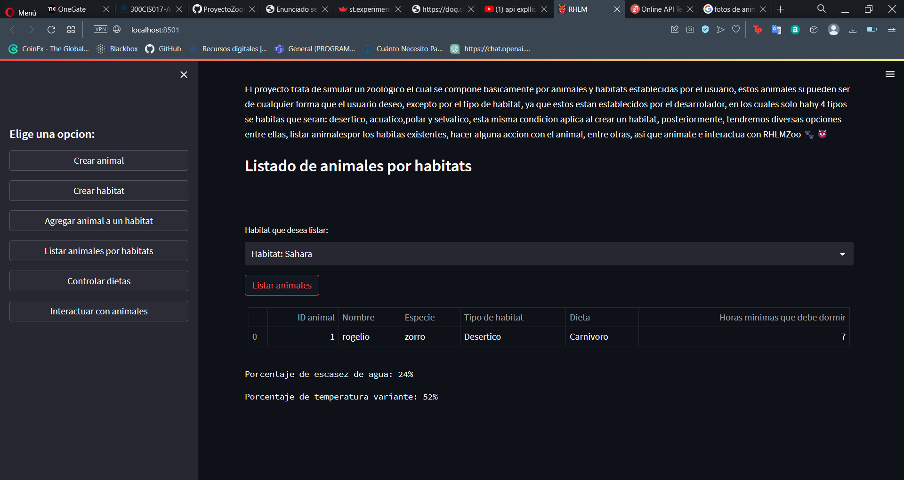

### Opcion 5

Al ingresar en la opcion 5, podemos controlar las dietas de los animales, podiendo asi de esta manera alimentar segun nuestros gustos a los animales de nuestro zoologico, en este menu podremos agregar, eliminar o modificar las listas de alimentos ya establecidas por el desarrollador del programa
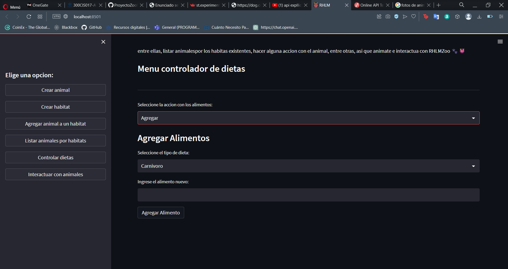
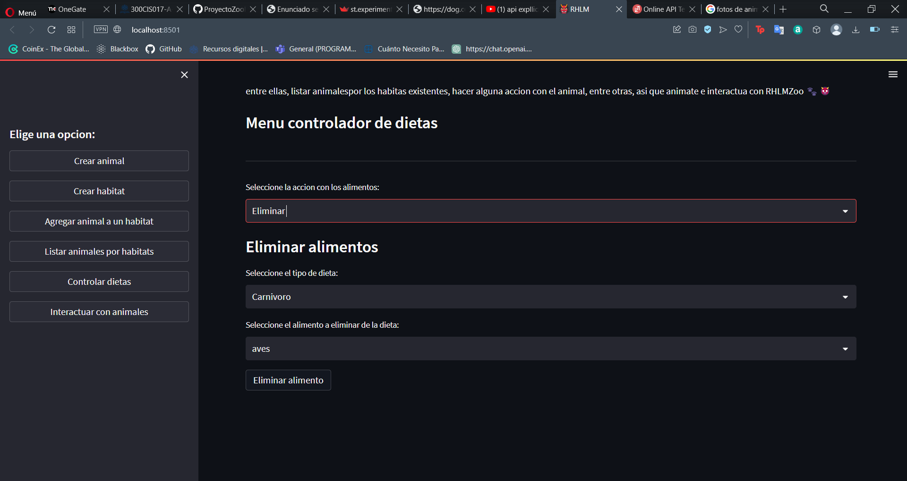
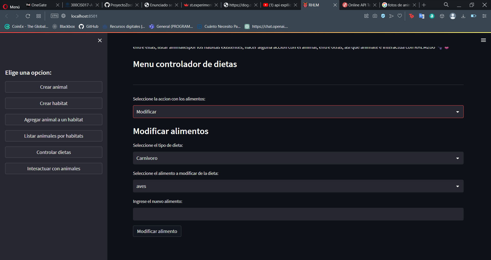

### Opcion 6
Al ingresar en la opcion 6, podremos hacer alguna accion con el animal, este nos mostrara el animal que quisieramos escoger que ya este dentro de un habitat y tambien nos hara escoger entre las 3 opciones de acciones que son: comer, dormir y jugar.
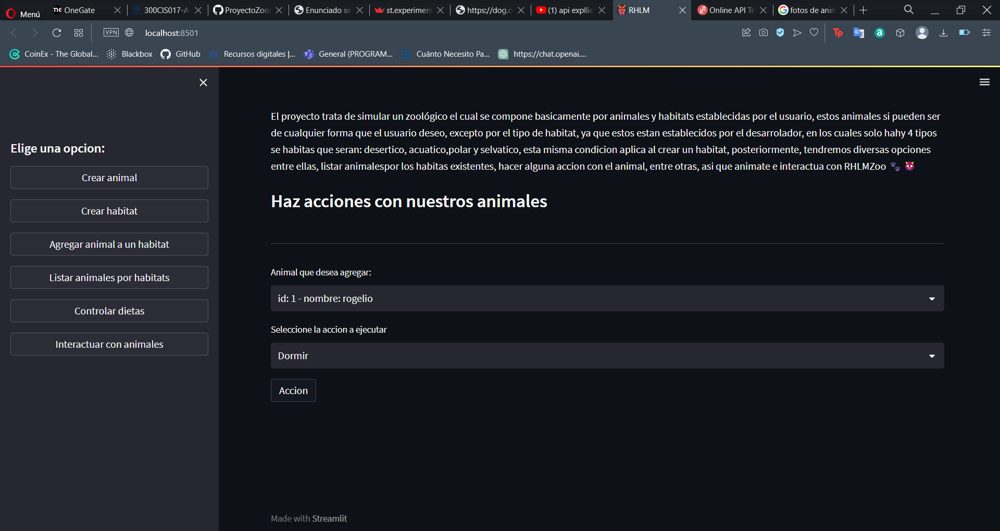
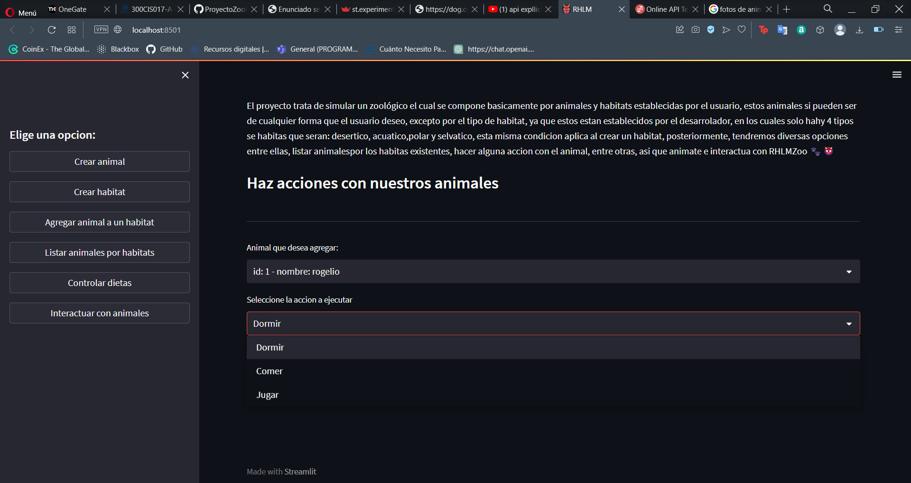
